# Path Tracer Project

**Learning Outcomes:**
- Understand the basics of path tracing and Monte Carlo methods.
- Implement ray generation for perspective cameras.
- Implement basic materials like lambertian materials and perfectly-smooth metals.
- Implement ray intersection with simple shapes such as spheres and triangles.
- Implement reinhard tonemapping and gamma correction.
- Implement a simple path tracer.

## Assignment Requirements

First, modify `run-all.ps1` such that the last scene is `Your First Name` in lowercase followed by an underscore followed by your student ID. For example, if your name is `Ahmed Mohamed Mahmoud` and your student ID is `123456789`, then the last scene should be `ahmed_123456789`.

Then, there are a set of TODOs in the code that you need to complete. These are marked with `TODO:` comments. You should fill these out according to the instructions provided.

The TODOs can be found in the following files:
- `color.hpp`
- `material.cpp`
- `shapes.cpp`
- `camera.cpp`
- `pathtracer.cpp`

After correctly implementing, run the `run-all.ps1` script.

Finally, submit the following files zipped together with the archive name being your student ID:
- `color.hpp`
- `material.cpp`
- `shapes.cpp`
- `camera.cpp`
- `pathtracer.cpp`
- The folder `output` containing all the output images.

### Hints

- In the folder `expect_output`, you will find outputs for all the scenes except the last one.
  - You can visually compare your results with these images to ensure that your implementation is correct.
  - The noise in the images won't exactly match with your output since the path tracing process is inherently stochastic.

- If the project is built in debug mode, 1000 samples will probably be slow.
  - Decrease the number of samples while debugging.
  - After you are done, build the project in release mode and increase the number of samples to 1000 again.

- The project implements a BVH to accelerate ray tracing. The BVH could make debugging harder.
  - You can disable it using the `--nobvh` or `-b` flag.
  - Also, you can change the default BVH config in the top of the `main` function.

- The project implements some debug modes that you may find helpful while debugging.
  - You can enable them using `--debug MODE` or `-d MODE` flag, where MODE can be `distance` or `normal`.
  - Also, you can change the default debug config in the top of the `main` function.

- Feel free to change the default config at the top of the `main` function during development, then return them back when you are done.

## Scenes

The project includes a set of scenes that you can use for testing. These include:

### Single Shape Scenes

| Scene Name | Description | Expected Output |
| ------------- | ------------- | ------------- |
| `tri_test0.0` | A triangle orthogonal to the camera direction. |  |
| `tri_test1.0` | A triangle tilted up slightly. | 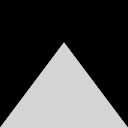 |
| `tri_test2.0` | A triange paralled to the camera direction. |  |
| `tri_test3.0` | A triangle behind the camera. |  |
| `sph_test0.0` | A triangle orthogonal to the camera direction. | 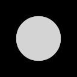 |
| `sph_test1.0` | A triangle tilted up slightly. | 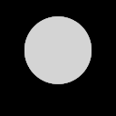 |
| `sph_test2.0` | A triange paralled to the camera direction. |  |
| `sph_test3.0` | A triangle behind the camera. |  |

**Note**: Scenes `tri_test0.0`, `tri_test1.0`, `tri_test1.0`, `tri_test1.0`, `sph_test0.0`, `sph_test1.0`, `sph_test2.0`, and `sph_test3.0` are similar to the ones above but with a resolution of `4x4`.

---

### Complex Scenes

| Scene Name | Description | Expected Output |
| ------------- | ------------- | ------------- |
| `balls0` | A group of lambertian balls under a day sky. | 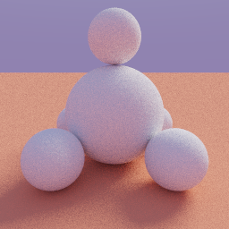 |
| `balls1` | A mix of lambertian and smooth metallic balls under a day sky. | 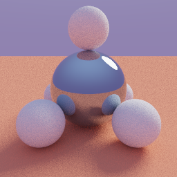 |
| `balls2` | A group of smooth metallic balls under a day sky. | 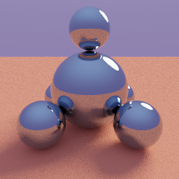 |
| `city0` | A group of lambertian blocks under a day sky. | 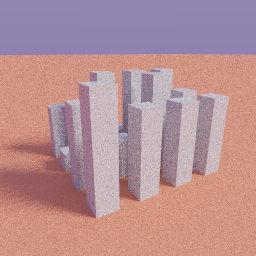 |
| `city1` | A group smooth metallic blocks under a day sky. | 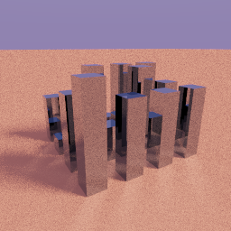 |
| `city2` | A group of lambertian blocks lit by emissive balls. | 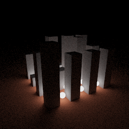 |
| `city3` | A group of smooth metallic blocks lit by emissive balls. | 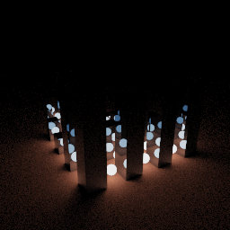 |
| `cornell_box0` | A simple Cornell box. | 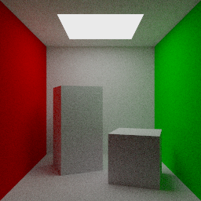 |
| `cornell_box1` | A Cornell box with a golden ball. | 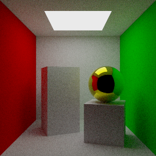 |
| `cornell_box2` | A simple Cornell box lit by an emissive ball. | 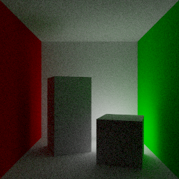 |
| `cornell_box3` | A Cornell box with a golden ball and lit by an emissive ball. | 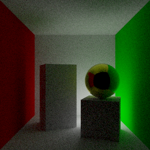 |